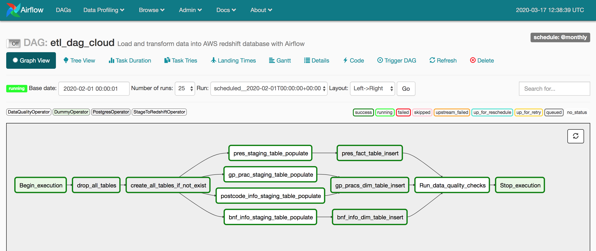
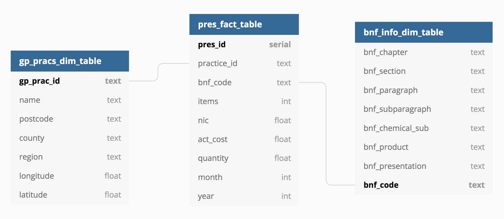
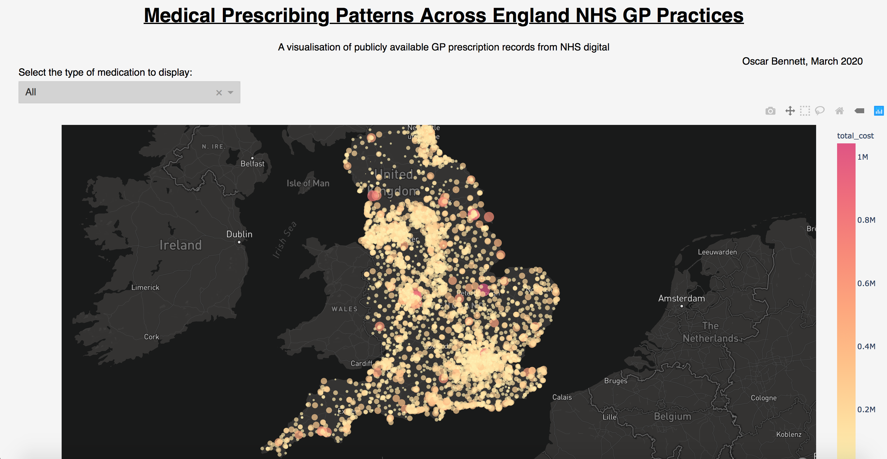

# Medical Prescribing Patterns Across NHS GP Practices

## Overview
This is a cloud based ETL data pipeline which feeds into a web app visualisation (currently hosted [here](www.talktin.com)). The goals are:
- To demonstrate patterns of prescribing across all the GP practices in England
- To provide a way to populate a cloud-based data warehouse in order to make it convenient to run any query against this data
- Demontrate how the use of modern data engineering tools and cloud based architecture makes it possible to do interesting things with health-related Big Data

## The Architecture

<p align="center"></p>

The ETL data pipeline was built using Postgres, Apache Airflow, AWS Redshift, and S3. This web app was built using Flask, Plotly Dash and Mapbox and is currently hosted on DigitalOcean [here](www.talktin.com). Throughout I make extensive use of Docker and Docker-Compose to manage the various deployment environments for the different tools and databases.

As shown, the data is trasformed into a useful schema and loaded into an AWS Redshift data warehouse. Once this has been done it is simple to run any SQL query you like against the tables in Redshift. The visualisation in the web app was created by running a query related to the amount of medication within a certain category being prescribed in all the GP practices across England. The various ETL steps are joined together in a DAG and orchestrated with Apache Airflow.

## The ETL Pipeline

- CSV files from NHS digital and the BNF are downloaded and transfered to the AWS S3 data lake
- CSV file from NHS digital containing GP practice details downloaded locally
- A Python script obtains location metadata for each GP practice via an API (https://postcodes.io)
- These API responses are converted into a CSV file and uploaded to the data lake
- **Data from the data lake is copied into AWS Redshift staging tables**
- **Data from these staging tables are transformed and loaded into a data warehouse table schema (see below)**
- **Automated data quality checks are run to ensure the integrity of the resulting data**
- A local Python script runs a series of queries against the data warehouse and saves the results as CSV files in an S3 bucket and locally
- These results are sent to the web app which generates a visualisation

Apache Airflow is used to schedule and orchestrate the steps in **bold**. The dependancy DAG is illustrated here:

<p align="center"></p>

## The Data Sources

The majority of the data comes from a large volume (~100GB) of anonymised GP prescription records which have been released publicly by [NHS digital](https://digital.nhs.uk). The data can be downloaded from their website [here](https://digital.nhs.uk/data-and-information/publications/statistical/practice-level-prescribing-data) and a detailed description of what the data contains can be found [here](https://digital.nhs.uk/data-and-information/areas-of-interest/prescribing/practice-level-prescribing-in-england-a-summary/practice-level-prescribing-data-more-information). This public sector information is published and made available under the [Open Government Licence v3.0](http://www.nationalarchives.gov.uk/doc/open-government-licence/version/3/). Prescription data from each month consists over a little over 9 million rows.

The prescribed medication in this dataset is referenced with a code used by the British National Formulary (BNF). An extra dataset (~19MB) providing more information and categorisation of each of these medications from the BNF was downloaded from the NHS Business Services Authority website ([here](https://apps.nhsbsa.nhs.uk/infosystems/data/showDataSelector.do?reportId=126)).

Finally, a free and open source API called [Postcodes.io](https://postcodes.io) was used to obtain latitude and longitude coordinates (as well as other location metadata) of the GP practices in the dataset to make plotting them easier.

Before building the ETL pipeline and the web app I carried out an early stage data exploration of all these datasets in a Jupyter notebook. I was able to better understand what each contained and learned about their specific quirks. The exploration is documented in this [notebook](./resources/explore_data.ipynb).

## The Data Warehouse Schema

The schema used in the data warehouse is demonstrated in this diagram:

<p align="center"></p>

More information about the meaning of these table columns can be found in the [data dictionary](./resources/data_dict.md).

## Data Quality Checks

Data quality checks are carried out by a custom airflow operator. They carry out a series of basic checks to ensure that the pipeline ran correctly. For example, there are checks to ensure rows are present in the fact and dimention tables and that certain columns do not contain any null values. 

## Alternative Data Scenarios

- **Data increased by x100**

If the amount of data involved were x100 bigger there are a number of possible strategies that could be used to cope gracefully with this change. 

Depending on the types of queries expected to be run, it may be possible to store aggregations of the data in the warehouse rather than storing it in a mostly unaggregated form. 

The Redshift cluster would likely need to scale out with more nodes. The distribution of data across these nodes would need to be carefully thought about to improve the efficiency of expected queries. Using DISTKEYs and SORTKEYs it should be possible to limit the amount of internode network communication necessary to run analytics. 

The E and T steps of the ETL pipeline could be taken over by an AWS EMR cluster running Apache Spark. This type of approach would take advantage of the massive parallelism achievable with a Spark cluster to speed up the whole pipeline. This would be especially helpful if aggregations needed to be computed as part of the adapted ETL pipeline.

- **Pipeline needs to be run every morning at 7am**

Apache Airflow is designed with this requirement in mind. The ETL DAG could easily be scheduled to run once a day at 7am UTC. Email notifications could be set up to provide alerts of problems with the automated pipeline runs.

- **Database needs to be accessed by 100+ people**

Redshift is well setup to meet this need. The cluster can scale out to meet almost any level of concurrent querying using a feature called concurrency scaling. With this enabled the Redshift warehouse will add resources to match the level of concurrency as it increases or decreases.

## The Visualisation Web App

<a href="https://www.talktin.com">
<p align="center"></p>
</a>

This is a visualisation of patterns of GP prescribing across England. Different types of medication can be displayed - you can select the type of medication using the dropdown menu in the top left. The "total cost" to the NHS of medication prescribed by a practice within a medication category was used as a summary statistic of the "amount" prescribed.

This web app was built using Flask, Plotly Dash and Mapbox and is currently hosted on a DigitalOcean instance [here](www.talktin.com). A Gunicorn production server behind a Nginx reverse proxy was used to serve the app. The whole setup exists in two docker containers build and run with docker-compose.

In order to setup SSL/TSL and serve the app securely over https I setup a reasonably simple two step deployment process using [Let's Encrypt](https://letsencrypt.org) as a certificate authority. This process proceeded like this:
- Ran a simple Nginx server over http along with an installation of certbot (the official certbot docker image)
- Ran the certbot server challenge to obtain an SSL certificant for the chosen domain name
- Removed this simple server
- Finally installed and ran the whole app/gunicorn/nginx stack and ran this new server setup using the previously acquired SSL certificate and key

For details on how to run this process see below.

## How To Run the ETL Pipeline

If you don't already have them, you will need to [install Docker](https://docs.docker.com/install/) and [install Docker-Compose](https://docs.docker.com/compose/install/) on your local machine. Next create a suitable python virtual environment.

```
$ git clone https://github.com/ofbennett/NHS_Prescribing_ETL_Pipeline.git
$ cd NHS_Prescribing_ETL_Pipeline
$ conda create -n etl_pipeline python=3.7 pip
$ source activate etl_pipeline
$ pip install -r requirements.txt
```

You need to get the data first before running the pipeline. You can download all the data from the locations specified above. Here is a summary:

- [Prescription data and GP Practice info](https://digital.nhs.uk/data-and-information/publications/statistical/practice-level-prescribing-data)
- [BNF info](https://apps.nhsbsa.nhs.uk/infosystems/data/showDataSelector.do?reportId=126)

Next you need to get the location metadata for each GP practice in the GP practice dataset. This uses the API provided by [Postcodes.io](https://postcodes.io). A python script is provided which does this. Make sure the file names and paths at the top are correct and run it:

```
$ python postcode_api.py
```

The results will be saved as a JSON file and a smaller CSV file in the same directory as the script. You now have all the necessary data.

There are two ways to run the ETL pipeline. You can either run it on your local machine using a modestly sized sample of the dataset, or you can run the full cloud-base ETL pipeline using any data sample size you like. **NB Running the ETL pipeline on the cloud will cost you money!**

### How to run the ETL pipeline locally

This version of the pipeline runs ETL locally and sets up a data warehouse in a local installation of Postgres (instead of Redshift). Run:

```
$ cd airflow
$ docker-compose -f airflow_local_docker_compose.yml up -d --build
```
This will start docker containers with airflow backed by a postgres database along another postgres database (the warehouse) running and linked together in a private network. Next you need to copy the data **into** the warehouse Postgres container so it can access it. This can be done using the `cp` docker command. An [example script](./resources/copy_data_into_pg_container.sh) is provided which can be adapted to carry this out easily.

Open a browser and go to `localhost:8080`. This should bring up the Airflow UI window. Ignore the "boto missing" and "etl_dag_cloud dag broken" error messages. Select the etl_dag_local DAG and turn it "on". This should set the whole pipeline running. You can watch the pipeline progress in either the Graph or Tree view. If all goes well all the task should run successfully and turn green.

The Postgres data warehouse is now populated. To run some queries there is a python script which will do this and save the results into the webapp for later visualisation. Run:

```
$ cd ..
$ python query_db_local.py
```

If all goes well you should now be able to run the web app and visualise the results of the queries you just ran!

### How to run the ETL pipeline on the cloud (AWS)

**NB: Running this pipeline on AWS will cost money**

This version of the pipeline runs ETL on AWS and sets up a data warehouse in a Redshift database. You will need access to an AWS account and carry out a bit of setup. You will need to:
- spin up a Redshift cluster
- setup a data lake S3 bucket
- setup a query dump S3 bucket

Explaining how to do this is beyond the scope of this doc, but have a look [here](https://docs.aws.amazon.com/redshift/latest/gsg/rs-gsg-launch-sample-cluster.html) and [here](https://docs.aws.amazon.com/AmazonS3/latest/user-guide/create-bucket.html) if you need help.

You will also need the aws [cli installed](https://docs.aws.amazon.com/cli/latest/userguide/install-cliv2.html). You will need to copy your aws credentials into the `.aws/credentials` file.

You need to create a config.cfg file from the template provided to locally contain your Redshift cluster details. Make sure you are in the repo top directory and run:

```
$ cp config_template.cfg config.cfg
```
Open `config.cfg` with a text editor and enter your cluster details.

Next run:
```
$ cd airflow
$ docker-compose -f airflow_cloud_docker_compose.yml up -d --build
```
This will start docker containers with Airflow backed by a Postgres database running and linked together in a private network. Next you need to copy the data to the S3 data lake. This can be done using the `aws s3 cp` command. An [example script](./resources/copy_data_to_data_lake.sh) is provided which can be adapted to carry this out easily.

Open a browser and go to `localhost:8080`. This should bring up the Airflow UI window. You will now need to create two custom airflow connections:

- my_aws_conn: connection type AWS. Populate with AWS credentials
- my_redshift_conn: connection type Postgres. Populate with your Redshift cluster information.

Next, select the etl_dag_cloud DAG and turn it "on". This should set the whole pipeline running. You can watch the pipeline progress in either the Graph or Tree view. If all goes well all the task should run successfully and turn green.

The Redshift data warehouse is now populated. To run some queries there is a python script which will do this and save the results into the webapp for later visualisation. Run:

```
$ cd ..
$ python query_db_cloud.py
```

If all goes well you should now be able to run the web app and visualise the results of the queries you just ran!

## How To Run the Web App

First off you need to create a config.cfg file to hold your Mapbox token. If you don't have one you can obtain a [Mapbox](https://www.mapbox.com) token by creating a free account with them. Run:

```
$ cd visualisation_web_app
$ cp config_template.cfg config.cfg
```
Then open the config.cfg file with a text editor and enter your Mapbox token.

For hosting the app you have two options:

- You can host the web app locally using a simple Flask Server and view it in a browser.
- You can deploy it on a remote Linux virtual machine using something like [DigitalOcean](https://www.digitalocean.com) or [AWS Lightsail](https://aws.amazon.com/lightsail/) and run a production grade server. This will make it available on the public internet.

### How to host locally

Create a new Python virtual environment. Make sure you are in the `visualisation_web_app` directory and then run:

```
$ conda deactivate
$ conda create -n web_app python=3.7 pip
$ source activate web_app
$ pip install -r requirements.txt
```
Next run the app:
```
$ python app.py
```
This should start a flask server locally on port 8050. Open a web browser and visit `localhost:8050`. You should see the app up and running!

### How to deploy on a remote host using a production server

1. Spin up an Linux instance using a cloud provider like [DigitalOcean](https://www.digitalocean.com) or [AWS Lightsail](https://aws.amazon.com/lightsail/).
2. Get a domain name and direct it at the public IP of your Linux instance
3. SSH into the instance
4. Setup the firewall to only allow ssh, http, and https inbound traffic 
```
$ ufw status
$ ufw delete allow ...
$ ufw allow ...
$ ufw status
```
5. Clone the repo
```
$ git clone https://github.com/ofbennett/NHS_Prescribing_ETL_Pipeline.git
```
6. Create the config.cfg file
```
$ cd NHS_Prescribing_ETL_Pipeline
$ cp config_template.cfg config.cfg
$ nano config.cfg
```
7. Use the nano editor to enter your Mapbox token. Then save and exit nano.
8. Choose a domain name and replace all occurences of `talktin.com` with it in the following files:
- `docker-compose-init-ssl.yml`
- `nginx_init_ssl/app.conf`
- `nginx_prod/app.conf`
9. Setup SSL/TSL with Let's Encrypt and certbot:
```
$ docker-compose -f docker-compose-init-ssl.yml up -d --build
$ docker ps --all   # certbot/certbot should have exited with status 0
$ ls   # a new ssl/ directory should be present with the SSL certificate and key
$ docker-compose -f docker-compose-init-ssl.yml down
```
10. Generate strong [Diffie-Hellman](https://en.wikipedia.org/wiki/Diffie–Hellman_key_exchange) coefficients for added security
```
$ openssl dhparam -out ~/NHS_Prescribing_ETL_Pipeline/visualisation_web_app/ssl/certbot/conf/dhparam.pem 2048
```
11. Run the production whole Flask/Gunicorn/Ngnix stack:
```
$ docker-compose -f docker-compose-prod.yml up -d --build
```

The web app should now be publically available at the domain of your choosing served securely over https!

## Next Steps
